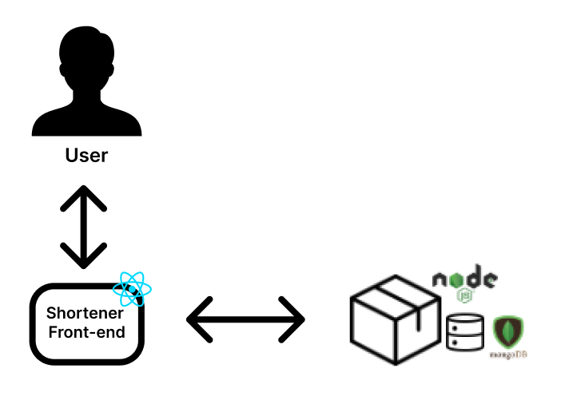

# URL Shortener

A project that consists of a web system that allows the user to shorten urls and view the ranking with the 5 most used urls.
It was developed in NodeJS, ReactJS and MongoDB.

## Deploy

The system was deployed at Digital Ocean and can be accessed at the following URLs:

- Backend: http://157.245.253.7:3000/
- Frontend: http://204.48.27.38:3001/

## How to contribute

### Frontend

Note: Docker and docker-compose must be installed on the machine.

1. Clone the repository
   `$ git clone https://gitlab.com/lucianaribeiro/shortener-de-url `

2. Enter the frontend directory
   `$ cd shortener-front`

3. Run Docker
   `$ docker-compose up --build `

### Backend

Note: Docker and docker-compose must be installed on the machine

1. Clone the repository
   `$ git clone https://gitlab.com/lucianaribeiro/shortener-de-url `

2. Enter the backend directory
   `$ cd shortener-back`

3. Run Docker
   `$ docker-compose up --build `

## Architecture

### Architectural Representation: Relationship Diagram

- ReactJS: React is a declarative, efficient, and flexible JavaScript library for building user interfaces. It allows for composing complex UIs from small and isolated pieces of code called “components”.

- NodeJS: Node.js is a JavaScript runtime built on Chrome's V8 JavaScript engine. It is designed to build scalable network applications. It is typically used on the server side and is event-driven.

- MongoDB: MongoDB is a NoSQL database framework. It is document-oriented, schema-free, non-relational, and open-source. MongoDB works with JSON files that contain the database information.

### Architecture Definition

The architecture chosen was MVC, Model-View-Controller. The models in the project define the data model and basic model functions, connecting directly to the database via mongoose.

The routes file stores all the views, i.e., all the routes of the project. The routes are the part that the frontend will use to connect with the backend.

Lastly, the utils store all the functions that manipulate and modify the data. It also contains functions that use external libraries.

The frontend was developed with a component-oriented approach. Using the ReactJS library, the frontend has components and views. The axios library was used to access the backend.

Author: Luciana Ribeiro @lucianaribeiro
