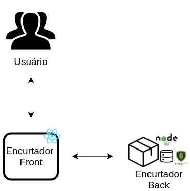

# Encurtador de URL

Um projeto que consiste em um sistema web que permite que o usuário encurte urls e visualize o ranking com as 5 urls mais usadas.
Foi desenvolvido em NodeJS, ReactJS e MongoDB. 

## Deploy

O deploy do sistema foi feito na Digital Ocean e pode ser acessado nas seguintes URLs:

- Backend: http://157.245.253.7:3000/
- Frontend: http://204.48.27.38:3001/

## Como contribuir

### Frontend

Obs: É necessário ter o docker e docker-compose instalados na máquina.

1. Clone o repositório
	```$ git clone https://gitlab.com/lucianaribeiro/encurtador-de-url ```

2. Entre na pasta do frontend
	```$ cd encurtador-front```

3. Rode o docker
	```$ docker-compose up --build ```


### Backend

Obs: É necessário ter o docker e docker-compose instalados na máquina.

1. Clone o repositório
	```$ git clone https://gitlab.com/lucianaribeiro/encurtador-de-url ```

2. Entre na pasta do frontend
	```$ cd encurtador-back```

3. Rode o docker
	```$ docker-compose up --build ```

## Arquitetura

### Representação Arquitetural: Diagrama de Relações



- ReactJS: O React é uma biblioteca JavaScript declarativa, eficiente e flexível para criar interfaces com o usuário. Ele permite compor UIs complexas a partir de pequenos e isolados códigos chamados “componentes”.

- NodeJS: Node.js é uma plataforma de aplicação para Javascript, que tem como principal objetivo facilitar a construção de softwares escaláveis. Ele geralmente é usado ao lado do servidor e é orientado para o estilo de programação voltada a evento. 

- MongoDB: MongoDB é um framework de banco de dados noSQL. Ele é orientado a documento, livre de esquemas, não relacional, e open-source. MongoDB trabalha com arquivos JSON que contém toda a informação do banco de dados.


### Definição da Arquitetura

A arquitetura escolhida foi MVC, Model-View-Controller. As models, no projeto, fazem o papel de definir o modelo de dados e definirem as funções básicas do modelo, que se conectam diretamente com o banco por meio do *mongoose*. 

O arquivo *routes* armazena todas as views, ou seja, todas as rotas do projeto. As rotas são a parte que o frontend usará para se conectar com o backend. 

Por último, as *utils* armazenam todas as funções que manipulam e modificam os dados. Também estão presentes as funções que utilizam bibliotecas externas.

O frontend foi desenvolvido orientado a componentes. Utilizando a bliblioteca ReactJS, o frontend possui componentes e views. Para acessar o backend, foi utilizado a bliblioteca *axios*


Author: Luciana Ribeiro @lucianaribeiro